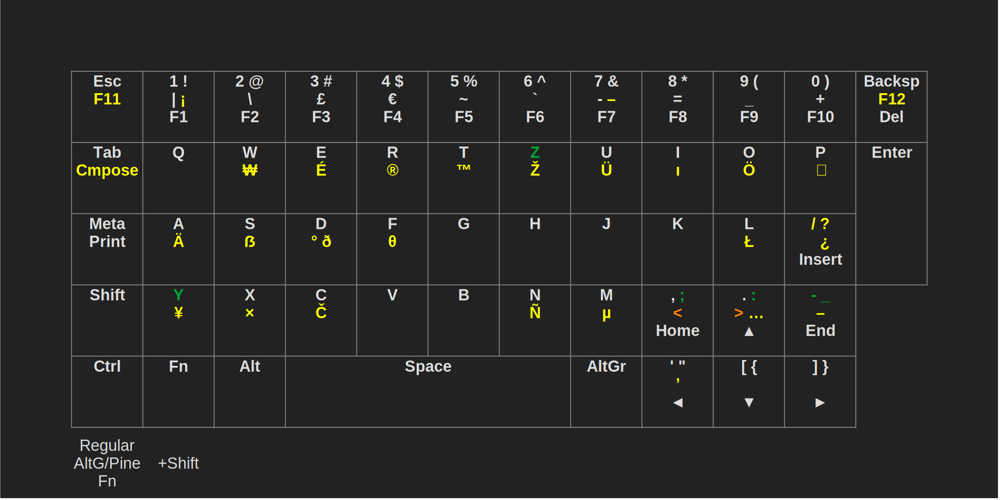
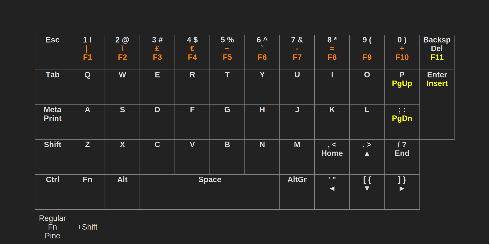
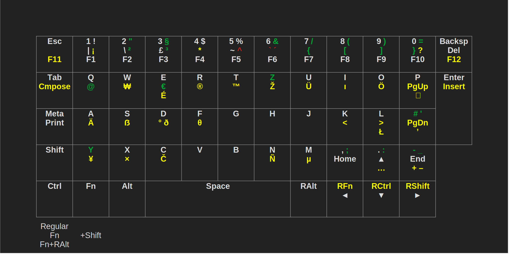

# ppkb-layouts

Various keyboard layouts for the PinePhone Keyboard Case to use it as intended or to go beyond into the realm of custom layouts.

If you need any help, feel free to contact me via any of [these methods](https://phal.io/links). If you would like me to make a custom layout for you, read [Requesting Custom Layouts](#requesting-custom-layouts).

If you find this helpful, you have the option of donating to me [here](https://phal.io/donate). Any amount is highly appreciated :)

## Content

1. [Introduction](#introduction)
2. [Layouts](#layouts)
	1. [xkb/kbd-Only Layouts](#xkb-kbd-only-layouts)
		1. [**Simple AltGr**, **Simple Pine**](#simple-altgr-simple-pine) (number row symbols on AltGr/Pine, F11 F12, international symbols)
		2. [**FnSymbols AltGr**, **FnSymbols Pine**](#fnsymbols-altgr-fnsymbols-pine) (number row symbols on Fn, F11 F12, international symbols)
		3. [**DE Simple AltGr**, **DE Simple Pine**](#de-simple-altgr-de-simple-pine) (QWERTZ, default number row symbols on AltGr/Pine, ÄÖÜẞ on AOUS, DE ",.-", F11 F12, international symbols)
		4. [**DE Dedicated Umlauts AltGr**](#de-dedicated-umlauts-altgr) (QWERTZ, DE number row symbols on AltGr, dedicated ÄÖÜ, ẞ on S, F11 F12, international symbols)
		5. [**DE Dedicated Umlauts Pine**](#de-dedicated-umlauts-pine) (QWERTZ, DE number row symbols on Pine, dedicated ÄÖÜẞ, F11 F12, international symbols)
		6. [**Default with Sprinkles of DE**](#default-with-sprinkles-of-de) (number row symbols on AltGr, ÄÖÜẞ on AOUS, F11 F12 on Q W)
	2. [Userspace Driver-Only Layouts](#userspace-driver-only-layouts)
		1. [**Extended Simple**](#extended-simple) (number row symbols on Fn, F11, PageUp/Down)
	3. [Full Layouts](#full-layouts)
		1. [**Extended AltGr**, **Extended Pine**](#extended-altgr-extended-pine) (number row symbols on AltGr/Pine, F11 F12, PageUp/Down, international symbols)
		2. [**Mirrored**](#mirrored) (mirrored modifier keys, number row symbols on Fn, F11 F12, PageUp/Down, international symbols)
		3. [**Mirrored WASD**](#mirrored-wasd) (arrow/navigation keys on WASD, mirrored modifier keys, number row symbols on Fn, F11 F12, PageUp/Down, international symbols)
		4. [**DE Mirrored**](#de-mirrored) (mirrored modifier keys, DE number row symbols, ÄÖÜẞ on AOUS, DE number row symbols on Fn, F11 F12, PageUp/Down, international symbols)
		5. [**DE Mirrored WASD**](#de-mirrored-wasd) (arrow/navigation keys on WASD, mirrored modifier keys, DE number row symbols on Fn, ÄÖÜẞ on AOUS, number row symbols on Fn, F11 F12, PageUp/Down, international symbols)
		6. [**Phalio**](#phalio)
3. [Installing Layouts](#installing-layouts)
	1. [Installing and Updating](#installing-and-updating)
	2. [xkb](#xkb)
	3. [kbd](#kbd)
	4. [Userspace Driver](#userspace-driver)
	5. [Kernel Driver](#kernel-driver)
		1. [Explanation](#explanation)
		2. [Introduction](#introduction-1)
		3. [Compiling the Kernel](#compiling-the-kernel)
		4. [As a Module](#as-a-module)
	6. [kbct](#kbct)
4. [Requesting Custom Layouts](#requesting-custom-layouts)
5. [Customising Layouts](#customising-layouts)
	1. [Introduction to Key Press Handling](#introduction-to-key-press-handling)
	2. [Getting Started](#getting-started)
	3. [xkb](#xkb-1)
		1. [General Usage](#general-usage)
		2. [PPKB-Specific Usage](#ppkb-specific-usage)
	4. [kbd](#kbd-1)
		1. [General Usage](#general-usage-1)
		2. [PPKB-Specific Usage](#ppkb-specific-usage-1)
	5. [Userspace Driver](#userspace-driver-1)
	6. [Kernel Driver](#kernel-driver-1)
	7. [kbct](#kbct-1)
6. [Troubleshooting](#troubleshooting)
	1. [Typing Not Working](#typing-not-working)
	2. [Stuck (Modifier) Keys](#stuck-modifier-keys)
	3. [Ghost Key Presses](#ghost-key-presses)
	4. [TTY Switch Shortcuts Not Working](#tty-switch-shortcuts-not-working)

## Introduction

The current kernel input driver features two layers: The regular layer and the Fn layer that gives access to movement keys, F1-10 and Delete. The missing symbols of a regular keyboard that are printed on another layer of the number row keycaps are not accessible at all by default. They were in the old driver, but some could only be accessed if shift was also held. This is all due to the way keyboards work in software. To be able to use the extra symbols, a keyboard layout has to be loaded that maps non-standard symbols to the standardised hardware keys, just like how any other language or otherwise customised layout works. This repository includes such layouts, from minimal ones that just make all symbols printed on the keycaps accessible to more fancy ones. Thanks to the keyboard just sending the position of the pressed key in the keyboard matrix and the driver(s) being open, layouts can be fully customised. If you want to know more about how all of this works and how to modify a layout or even make your own entirely, read [Customising Layouts](#customising-layouts).

If you only want the number row symbols to work and nothing else, an xkb model for that may already come with your distribution. Check if holding Right Alt and pressing number keys produces symbols. Otherwise read [this](https://phal.io/tech/pinephone-keyboard#ppkb-model) for more information.

Refer to [Installing Layouts](#installing-layouts) to learn how to install layouts.

The keys to access a layout’s layers are displayed at the bottom left of each image. All changes from the default are coloured. Colours that are not yellow have special meaning and are explained in each layout’s bullet list. Orange usually means that just the modifier to access a symbol has changed.

If you need any help installing a layout or making your own, feel free to contact me via any of [these methods](https://phal.io/links). I’m always happy to help :) If you would like me to make a custom layout for you, read [Requesting Custom Layouts](#requesting-custom-layouts).

Note that the PinePhone is commonly abbreviated as PP and the PinePhone Keyboard as PPKB.

**I especially recommend the [Mirrored](#mirrored) layouts for thumb-only handheld typing that add a second set of modifier keys on the right side of the keyboard. If you just want minimum functionality and a simple install process, the [Simple AltGr or Simple Pine](#simple-altgr-simple-pine) layouts, or if you need PageUp/Down the [Extended Simple](#extended-simple)/[Extended](#extended-altgr-pine) layouts, are a good choice.**

**All layouts were thoroughly tested in every possible modifier combination and in both GUIs and TTYs, but only partly tested after I added support for modified kernel drivers, which required significant changes. It is possible that some key(combination)s don’t work that should work. Please report such occurrences so that they can be fixed.**

Lastly I would like to thank [Megi](https://xnux.eu/log/) for all of his work regarding the PinePhone Keyboard, and of course the PinePhone in general, and for answering my questions that resulted in me being able to modify the kernel driver to get all layouts (and especially my own layout, I can’t live without it), to work flawlessly. You can donate to him at [https://xnux.eu/contribute.html](https://xnux.eu/contribute.html).

## Layouts

## xkb/kbd-Only Layouts

These layouts are limited in what they can do (specifically they cannot add an Fn layer to any key that doesn’t have one by default) but they are the simplest to install as they only require putting the xkb and/or kbd files into the right spot and using a command. They also require the new kernel driver, the one where Fn+numRow results in F1-F10. If you’re still on an older kernel version where these key combinations print extra symbols like |\£, you have to use a layout from the other categories.

Optionally, you may use them with the `regular-improved` kernel driver to prevent Fn from getting keys stuck if not released last.

### Simple AltGr, Simple Pine


These layouts are intended to be simple and just do two things: They make the extra symbols on the number row accessible using either AltGr or the Pine key and they add more symbols for international compatibility. F11 and F12 are also added just because there was space but on different layers due to F1-10 and Del being on the same layer by default and this layout not intending to change any default mapping.

#### Changes from Default

- AltGr *or* Pine key to access additional layer
- number row symbols on AltGr *or* Pine layer
- F11 and F12 on Esc and Backspace (AltGr *or* Pine layer)
- additional international and miscellaneous symbols on AltGr *or* Pine layer
- compose key

#### Installation Requirements

xkb: layout: `pp`, variants: `altgr` or `pine`  
kbd: `ppkb-altgr.map` or `ppkb-pine.map`

### FnSymbols AltGr, FnSymbols Pine


These layouts are the same as [Simple AltGr or Simple Pine](#simple-altgr-simple-pine) but they swap the number row extra layer keys, so they use the Fn key for extra number row symbols and AltGr or Pine for F1-F12, just like the old kernel driver did.

#### Changes from Default

- AltGr *or* Pine key to access additional layer
- number row modifiers swapped (Fn for symbols and AltGr *or* Pine for F1-F12) (symbols that only have their modifiers swapped but are otherwise the same as default are coloured orange)
- number row symbols on Fn layer
- F11 and F12 on Esc and Backspace (AltGr *or* Pine layer)
- additional international and miscellaneous symbols on AltGr *or* Pine layer
- compose key

#### Installation Requirements

xkb: layout: `pp`, variants: `fnsymbols-altgrf12` or `fnsymbols-pinef12`  
kbd: `ppkb-fnsymbols-altgrf12.map` or `ppkb-fnsymbols-pinef12.map`

### DE Simple AltGr, DE Simple Pine



These layouts are intended to include the most important features of the standard German layout: Y and Z swapped, ÄÖÜẞ on AOUS and the usual ,; .: -_ mapping since these are often used, well included in people’s muscle memory and crucial to a good typing experience, at least in my opinion. All other symbols are kept unchanged, so you can look at what is printed on the keycaps and know what they will type instead of having to memorise them. With one exception: Since `;:` is now on `,` and `.`, the `;:` key would be useless and wasted. Additionally, the `/?` key has been changed to `-_` and these symbols would now be missing. I therefore moved `/?` to `;:`. If you want as many keys as possible to type what is printed on them, I would recommend swapping the `/?` and `;:` keycaps for this layout, as well as Y and Z of course (see [Removing Keycaps](https://phal.io/tech/pinephone-keyboard#removing-keycaps)). `<` and `>` are kept on the same keys as printed but moved to the AltGr or Pine layer to make room for `;` and `:`. I believe this is the best compromise between the German layout and keycaps showing what the keys are mapped to, but I’m of course open to suggestions on how to improve this. 

These layouts also make the extra symbols on the number row accessible using either AltGr or the Pine key and they add more symbols for international compatibility. F11 and F12 are also added just because there was space but on different layers due to F1-10 and Del being on the same layer by default and this layout not intending to change any default mapping other than German-specific things.

The version of this layout with the Pine key to access additional symbols has a significant drawback: Pressing `Shift` + `Pine` + `A` to type a capital Ä will also type a Z, see [Ghost Key Presses](#ghost-key-presses). If you rarely need a capital Ä, this won’t be a big deal and you can just delete the Z when it happens. Otherwise use the AltGr version.

#### Changes from Default

- AltGr *or* Pine key to access additional layer
- number row symbols on AltGr *or* Pine layer
- QWERTZ (Y and Z swapped) (coloured green)
- ÄÖÜẞ on AOUS (AltGr *or* Pine layer) (as most of these layouts have anyway)
- standard German ,; .: -_ (coloured green)
- /? moved to ;: since these symbols were moved to ,.
- <> moved to the AltGr *or* Pine layer to make room for ;: (coloured orange)
- F11 and F12 on Esc and Backspace (AltGr *or* Pine layer)
- additional international and miscellaneous symbols on AltGr *or* Pine layer
- compose key

#### Installation Requirements

xkb: layout: `pp`, variants: `de-simple-altgr` or `de-simple-pine`  
kbd: `ppkb-de-simple-altgr.map` or `ppkb-de-simple-pine.map`

### DE Dedicated Umlauts AltGr


This layout intends to recreate the standard German QWERTZ layout, including placement of symbols. Symbols from missing keys are put on unused third layers of the number row, in the same spot as the symbols printed on the keycaps if possible. The extra letters “ÄÖÜ” are placed on dedicated keys at the bottom right while ẞ is on the third layer of S. The [DE Dedicated Umlauts Pine](#de-dedicated-umlauts-pine) layout is an alternative version of this one that uses the Pine key for the third layer, freeing the AltGr key to be used as another dedicated key for ẞ. F11 and F12 are also added just because there was space but on different layers due to F1-10 and Del being on the same layer by default and this layout not intending to change any default mapping other than German-specific things.

(Note that Home is usually called Pos1 on German keyboards)

#### Changes from Default

- AltGr key to access additional layer
- QWERTZ (Y and Z swapped)
- dedicated ÄÖÜ keys
- ẞ on S (AltGr layer)
- symbol placement the same as standard German if possible (coloured green), otherwise kept default if possible
- ^ ´ ` are dead keys (coloured red)
- <> are on the same keys as printed but moved to the AltGr layer to make room for the default German ;: placement (coloured orange)
- number row symbols on AltGr layer
- F11 and F12 on Esc and Backspace (AltGr layer)
- additional international and miscellaneous symbols on AltGr layer
- compose key

#### Installation Requirements

xkb: layout: `pp`, variant: `de-altgr`  
kbd: `ppkb-de-altgr.map`

### DE Dedicated Umlauts Pine


This layout is the same as [DE Dedicated Umlauts AltGr](#de-dedicated-umlauts-altgr) but it uses the Pine key for the third layer, freeing the AltGr key to be used as another dedicated key for ẞ. This means that all additional letters of the German alphabet, ÄÖÜẞ, have dedicated keys.

(Note that Home is usually called Pos1 on German keyboards)

#### Changes from Default

- Pine key to access additional layer
- QWERTZ (Y and Z swapped)
- dedicated ÄÖÜẞ keys
- symbol placement the same as standard German if possible (coloured green), otherwise kept default if possible
- ^ ´ ` are dead keys (coloured red)
- <> are on the same keys as printed but moved to the Pine layer to make room for the default German ;: placement (coloured orange)
- number row symbols on Pine layer
- F11 and F12 on Esc and Backspace (Pine layer)
- additional international and miscellaneous symbols on Pine layer
- compose key

#### Installation Requirements

xkb: layout: `pp`, variant: `de-pine`  
kbd: `ppkb-de-pine.map`

### Default with Sprinkles of DE


This layout was requested by UltraBlackLinux. It adds ÄÖÜẞ on AOUS and F11 F12 in a convenient to reach spot while keeping everything else the same. That way you can look at what is printed on the keycaps and know what they will type instead of having to memorise unusual mappings.

(Note that Home is usually called Pos1 on German keyboards)

#### Changes from Default

- ÄÖÜẞ on AOUS (AltGr layer)
- F11 F12 on Q W (AltGr layer)

#### Installation Requirements

xkb: layout: `pp`, variant: `default-de-sprinkles`  
kbd: `ppkb-default-de-sprinkles.map`

## Userspace Driver-Only Layouts

These layouts are limited in what they can do as they only change entire key scan codes and not what symbols they produce, but that means only one component is required to make them work in both GUIs and TTYs.

### Extended Simple



This layout is intended to be simple and does only two things: It adds the additional number row symbols using the Fn key as modifier, as well as extending the layout to include some missing keys that some might find important, specifically by adding F11 (commonly used to toggle full screen) on Backspace with the Pine key as modifier and PageUp/Down on P and ; with Fn, moving Insert from ; to Enter.

F12 is not added even though there are 12 keys in the top row because using the userspace driver’s special modifier keys Fn and Pine in combination with the Esc key activates Fn/Pine Lock (like Caps Lock), redefining these additional Esc levels is not possible with a keymap.

[Extended AltGr and Extended Pine](#extended-altgr-pine) are “advanced” versions of this layout that add international symbols and F12, therefore also requiring an xkb/kbd component.

#### Changes from Default

- Pine key to access additional layer
- number row symbols on Fn layer
- F1-F10 are moved from the Fn layer to the Pine layer and swapped with the symbols (coloured orange)
- F11 on Backspace (Pine layer)
- PageUp/Down on P and ; (Fn layer)
- Insert moved to Fn layer of Enter to make room for PageDown

#### Installation Requirements

Userspace driver: `extended-simple.txt`

## Full Layouts

These layouts require both a driver component and an xkb and/or kbd component, and allow full customisation.

### Extended AltGr, Extended Pine


This layout adds the additional number row symbols using either AltGr or Pine as modifier, as well as extending the layout to include some missing keys that some might find important, specifically by adding F11 and F12 and PageUp/Down on P and ;, moving Insert from ; to Enter and Del to the AltGr/Pine layer. It also adds international symbols on additional layers.

#### Changes from Default

- AltGr *or* Pine key to access additional layer
- number row symbols on AltGr *or* Pine layer
- F11 and F12 on Esc and Backspace (Fn layer)
- Delete moved to AltGr *or* Pine layer to make room for F12 so F1-F12 can be on the same layer (coloured orange)
- PageUp/Down on P and ; (Fn layer)
- Insert moved to Fn layer of Enter to make room for PageDown
- additional international and miscellaneous symbols on AltGr *or* Pine layer
- compose key

#### Installation Requirements

xkb: layout: `pp-driver`, variants: `extended-altgr` or `extended-pine`  
kbd: `ppkb-extended-altgr.map` or `ppkb-extended-pine.map`  
Driver: `userspace-driver/full.txt` or `kernel-driver/pinephone-keyboard-full.patch` or `kernel-driver/pinephone-keyboard-full-improved.patch`

### Mirrored


This layout provides mirrored modifier keys, meaning that both left and right versions of Shift, Control, Fn and Alt exist. This is very useful for thumb-only handheld typing as it allows you to e.g. press RightShift with your right thumb and Q with your left thumb to type a capital Q instead of having to press both LeftShift and Q on the left side, which would require partially letting go of the device with either hand, unless your thumbs are twice as long as mine. It also expands key definitions by F11 F12, PageUp/Down and international symbols.

Since the right versions of Fn, Ctrl and Shift also double as the movement keys ◄ ▼ ► if any Fn is held, it’s not possible to combine any Fn and right Ctrl or Shift. For example, combining any Fn and right Shift to access the fourth layer does not work since LFn+RShift results in ►. Use RFn+LShift (thumb-only-friendly) or LFn+LShift or RFn+RShift instead. If you want right modifier keys that are dedicated and work in any combination, consider using [Mirrored WASD](#mirrored-wasd) instead which moves the navigation keys to the WASD area.

As you can see, `"{}` exist twice. That is because they are on the Fn layer and putting them on the Fn+shift layers of `'[]` is therefore slightly less comfortable as it requires pressing two modifier keys and J K L, which is impossible to do using just thumbs. Therefore I also put them on the regular Fn layer on the keys above these keys, giving you two options: Using them with only one modifier key on the upper keys which is easy for thumb-only typing or using them with shift on the lower keys as you may be used to from the default US layout.

#### Changes from Default

- Fn key to access first additional layer
- Fn + RightAlt to access second additional layer
- number row symbols on Fn layer
- mirrored modifier keys: RAlt, RFn, RCtrl and RShift replacing the keys to the right of Space
- " [ ] moved to JKL and UIO to make room for right modifiers
- F11 and F12 on Esc and Backspace (Fn+RAlt layer)
- F1-F10 are moved from the Fn layer to the Fn+RAlt layer and swapped with the symbols (coloured orange)
- PageUp/Down on P and ; (Fn layer)
- Insert moved to Fn layer of Enter to make room for PageDown
- additional international and miscellaneous symbols
- compose key

#### Installation Requirements

xkb: layout: `pp-driver`, variant: `mirrored`  
kbd: `ppkb-mirrored.map`  
Driver: `userspace-driver/full.txt` or `kernel-driver/pinephone-keyboard-full.patch` or `kernel-driver/pinephone-keyboard-full-improved.patch`

**If you use this layout in a graphical environment with `kernel-driver/pinephone-keyboard-full-improved.patch`,** you also have to install the following kbct component to circumvent an undesired behaviour in xkb that makes it only send one arrow key press when you hold the arrow keys. See the last paragraph of [General xkb Usage](#general-usage) for a more detailed explanation.

kbct: `ppkb-driver-full-improved-fix.yaml`

### Mirrored WASD


This layout moves the arrow keys, home/end and pageup/down to WASD QE RF. Like regular [Mirrored](#mirrored), it also  provides mirrored modifier keys, meaning that both left and right versions of Shift, Control, Fn and Alt exist. This is very useful for thumb-only handheld typing as it allows you to e.g. press RightShift with your right thumb and Q with your left thumb to type a capital Q instead of having to press both LeftShift and Q on the left side, which would require partially letting go of the device with either hand, unless your thumbs are twice as long as mine. It also expands key definitions by F11 F12 and international symbols.

As you can see, `{}"` exist twice. That is because they are on the Fn layer and putting them on the Fn+shift layers of `[]'` is therefore slightly less comfortable as it requires pressing two modifier keys and ,./, which is impossible to do using just thumbs. Therefore I also put them on the regular Fn layer on the keys above these keys, giving you two options: Using them with only one modifier key on the upper keys which is easy for thumb-only typing or using them with shift on the lower keys as you may be used to from the default US layout.

#### Changes from Default

- Fn key to access first additional layer
- Fn + RFn to access second additional layer
- number row symbols on Fn layer
- WASD movement keys: arrow keys on WASD, End/Home on Q/E, PageUp/Down on R/F
- mirrored modifier keys: RAlt, RFn, RCtrl and RShift replacing the keys to the right of Space
- " [ ] moved to ,./ and KL;  to make room for right modifiers
- F11 and F12 on Esc and Backspace (Fn+RFn layer)
- F1-F10 are moved from the Fn layer to the Fn+RFn layer and swapped with the symbols (coloured orange)
- Insert moved to Fn layer of Enter to make room for "
- additional international and miscellaneous symbols
- compose key

#### Installation Requirements

xkb: layout: `pp-driver`, variant: `mirrored-wasd`  
kbd: `ppkb-mirrored-wasd.map`  
Driver: `userspace-driver/full.txt` or `kernel-driver/pinephone-keyboard-full.patch` or `kernel-driver/pinephone-keyboard-full-improved.patch`

### DE Mirrored



This layout provides mirrored modifier keys, meaning that both left and right versions of Shift, Control, Fn and Alt exist. This is very useful for thumb-only handheld typing as it allows you to e.g. press RightShift with your right thumb and Q with your left thumb to type a capital Q instead of having to press both LeftShift and Q on the left side, which would require partially letting go of the device with either hand, unless your thumbs are twice as long as mine. It also expands key definitions by F11 F12, PageUp/Down and international symbols. It also expands key definitions by F11 F12, PageUp/Down and international symbols.

Besides that, this layout intends to recreate the standard German QWERTZ layout, including placement of symbols. Symbols from missing keys are put on unused third layers of the number row, in the same spot as the symbols printed on the keycaps if possible. Unlike the normal [DE](#de-altgr) layouts, this one puts the extra letters “ÄÖÜẞ” on the Fn layer of AOUS.

Since the right versions of Fn, Ctrl and Shift also double as the movement keys ◄ ▼ ► if Fn is held, it’s not possible to combine any Fn and right Ctrl or Shift. For example, combining any Fn and right Shift to access the fourth layer does not work since LFn+RShift results in ►. Use RFn+LShift (thumb-only-friendly) or LFn+LShift or RFn+RShift instead. If you want right modifier keys that are dedicated and work in any combination, consider using [DE Mirrored WASD](#de-mirrored-wasd) instead which moves the navigation keys to the WASD area.

(Note that Home is usually called Pos1 and PageUp/Down BildAuf/Ab on German keyboards)

#### Changes from Default

- Fn key to access first additional layer
- Fn + RightAlt to access second additional layer
- number row symbols on Fn layer
- QWERTZ (Y and Z swapped)
- ÄÖÜẞ on AOUS (Fn layer) (as most of these layouts have anyway)
- symbol placement the same as standard German if possible (coloured green), otherwise kept default if possible
- ^ ´ ` are dead keys (coloured red)
- mirrored modifier keys: RAlt, RFn, RCtrl and RShift replacing the keys to the right of Space
- F11 and F12 on Esc and Backspace (Fn+RAlt layer)
- <> moved to KL (because that’s one row above where they’re printed on the keycaps)
- F1-F10 are moved from the Fn layer to the Fn+RAlt layer and swapped with the symbols (coloured orange)
- PageUp/Down on P and ; (Fn layer)
- Insert moved to Fn layer of Enter to make room for PageDown
- additional international and miscellaneous symbols
- compose key

#### Installation Requirements

xkb: layout: `pp-driver`, variant: `de-mirrored`  
kbd: `ppkb-de-mirrored.map`  
Driver: `userspace-driver/full.txt` or `kernel-driver/pinephone-keyboard-full.patch` or `kernel-driver/pinephone-keyboard-full-improved.patch`

**If you use this layout in a graphical environment with `kernel-driver/pinephone-keyboard-full-improved.patch`,** you also have to install the following kbct component to circumvent an undesired behaviour in xkb that makes it only send one arrow key press when you hold the arrow keys. See the last paragraph of [General xkb Usage](#general-usage) for a more detailed explanation.

kbct: `ppkb-driver-full-improved-fix.yaml`

### DE Mirrored WASD


This layout moves the arrow keys, home/end and pageup/down to WASD QE RF. Like regular [DE Mirrored](#de-mirrored), it also provides mirrored modifier keys, meaning that both left and right versions of Shift, Control, Fn and Alt exist. This is very useful for thumb-only handheld typing as it allows you to e.g. press RightShift with your right thumb and Q with your left thumb to type a capital Q instead of having to press both LeftShift and Q on the left side, which would require partially letting go of the device with either hand, unless your thumbs are twice as long as mine. It also expands key definitions by F11 F12, PageUp/Down and international symbols. It also expands key definitions by F11 F12 and international symbols.

Besides that, this layout intends to recreate the standard German QWERTZ layout, including placement of symbols. Symbols from missing keys are put on unused third layers of the number row, in the same spot as the symbols printed on the keycaps if possible. Unlike the [DE Dedicated Umlauts AltGr](#de-dedicated-umlauts-altgr) and [DE Dedicated Umlauts Pine](#de-dedicated-umlauts-Pine)layouts, this one puts the extra letters “ÄÖÜẞ” on the Fn layer. Since A and S are already used by the arrow keys unlike in [DE Mirrored](#de-mirrored), Ä is placed on I since that’s between Ü and Ö, and ẞ is placed on P since that’s next to ÄÖÜ and right below the key where it would be on a regular German layout. Since the Fn level for Q and E is already used, @ and € are placed on J and K which is on the home row and easy to reach using the right hand/thumb.

(Note that Home is usually called Pos1 and PageUp/Down BildAuf/Ab on German keyboards)

#### Changes from Default

- Fn key to access first additional layer
- Fn + RFn to access second additional layer
- number row symbols on Fn layer
- QWERTZ (Y and Z swapped)
- ÄÖÜẞ on AOUS (Fn layer) (as most of these layouts have anyway)
- symbol placement the same as standard German if possible (coloured green), otherwise kept default if possible
- ^ ´ ` are dead keys (coloured red)
- WASD movement keys: arrow keys on WASD, End/Home on Q/E, PageUp/Down on R/F
- mirrored modifier keys: RAlt, RFn, RCtrl and RShift replacing the keys to the right of Space
- F11 and F12 on Esc and Backspace (Fn+RFn layer)
- <> are on the same keys as printed but moved to the Fn layer to make room for the default German ;: placement (coloured orange)
- @ and € are moved from their standard German positions to J and K since they are easy to reach to make room for Home and End
- F1-F10 are moved from the Fn layer to the Fn+RFn layer and swapped with the symbols (coloured orange)
- Insert moved to Fn layer of Enter to make room for ’
- additional international and miscellaneous symbols
- compose key

#### Installation Requirements

xkb: layout: `pp-driver`, variant: `de-mirrored-wasd`  
kbd: `ppkb-de-mirrored-wasd.map`  
Driver: `userspace-driver/full.txt` or `kernel-driver/pinephone-keyboard-full.patch` or `kernel-driver/pinephone-keyboard-full-improved.patch`

### Phalio


This layout started with the goal of making it as close to my usual custom layout as possible, of course also adding badly needed PageUp/Down, F11, F12 and lots of other characters and symbols. This also included putting navigational keys in the WASD area, which is probably the best part of my usual layout. While making it I also had a great idea to solve the thumb-only handheld typing issue: Mirrored modifier keys. In this case they’re extremely useful, unlike on a regular keyboard where I rarely use them. Typing and using shortcuts like in Emacs works wonderfully and smoothly now.

#### Changes from Default

- Fn key to access first additional layer
- Fn + RFn to access second additional layer
- number row symbols on Fn layer
- ÄÖÜẞ on IOUZ (Fn layer) (I instead of A because A is taken by ◄ and it’s between O and U; Z because I have it on the key between Z and LShift on big keyboards)
- the same as my usual custom layout where possible (coloured green, or teal if the same key but different layer)
- ,.- the same as standard German and because - is very important and needs to be a dedicated key
- ^ ´ ¯ are dead keys (coloured red) but not ` as it’s used in things like Markdown
- WASD movement keys: arrow keys on WASD, End/Home on Q/E, PageUp/Down on R/F
- mirrored modifier keys: RAlt, RFn, RCtrl and RShift replacing the keys to the right of Space
- F11 and F12 on 0 and Backspace (Fn+RFn layer)
- F11 on 0 because I’m used to it being to the right to toggle full screen, F10 on Esc because that’s where I put 0
- 0 is moved to Esc because it’s less than 1 and should come before 1
- Esc is moved to the Fn layer of Tab to make room for 0 and that’s still close to the original position (the default position on the PPKB is different from regular keyboards anyway)
- ​+ is now a dedicated key since 0 was moved to Esc, this is where I always have + and just like - it’s important and should be a dedicated key
- / is also crucial and very often used and has to be a dedicated key, I always have it next to enter and \ | on its layers
- brackets are in pairs in the bottom row because they can’t be in my usual locations, two pairs each are above the 4 wide spacebar and to the right of it so it’s easy to know where each one is
- @$&€ are on HJKL where they are easy to reach and grouped as the first 3 are important in code and stuff
- F1-F9 are moved from the Fn layer to the Fn+RFn layer and swapped with the symbols (coloured orange)
- Insert moved to Fn layer of Enter to make room for |
- additional international and miscellaneous symbols
- compose key

#### Installation Requirements

xkb: layout: `pp-driver`, variant: `phalio`  
kbd: `ppkb-phalio.map`  
Driver: `userspace-driver/full.txt` or `kernel-driver/pinephone-keyboard-full.patch` or `kernel-driver/pinephone-keyboard-full-improved.patch`

## Installing Layouts

### Installing and Updating

Layouts may consist of xkb, kbd, userspace driver or kernel driver components. xkb defines symbols for graphical environments and kbd defines symbols for TTYs. If you only use graphical environments, you may omit the kbd part (although it won’t hurt in case you ever need it) and vice versa. Driver components influence both environments and are usually combined with xkb and kbd components for full customisability. You can only use either the userspace driver or the kernel driver. The userspace driver is simpler to install but less customisable and just like the default kernel driver has the issue of [getting keys stuck if Fn/Pine is not let go of last](#stuck-modifier-keys), while custom kernel drivers (the ones that have `-improved` in their name) get rid of this issue and allow maximum customisation (see [Kernel Driver](#kernel-driver) for a longer explanation on the differences). Each layout includes a list of its components that have to be installed to use the layout.

To download the layouts, simply use `git clone https://codeberg.org/phalio/ppkb-layouts.git`. To update them, `cd` to the `ppkb-layouts` directory, use `git pull`, execute the install scripts you need again and reboot.

### xkb

Xkb sets layouts for graphical environments (what you most likely want).

#### Copying Files

Copying the xkb files can simply be done by using the `install-xkb.sh` script that comes with this repository. It has to be executed with sudo, so check what it does first. To copy the files manually instead, you have to copy `xkb/pp` and `xkb/pp-driver` to `/usr/share/X11/xkb/symbols/`, as well as `xkb/evdev.xml` to both `/usr/share/X11/xkb/rules/evdev.xml` and `/usr/share/X11/xkb/rules/base.xml`, and `xkb/evdev.lst` to both `/usr/share/X11/xkb/rules/evdev.lst` and `/usr/share/X11/xkb/rules/base.lst`.

This will only add the pp and pp-driver layout files, so it won’t override any other custom layouts you may have. It will however override any custom entries you have made in evdev.

#### Selecting Layout

Xkb is *the* software handling keyboard layouts on Linux, both on X and on Wayland, so your desktop environment should have a way to set the layout either in graphical settings applications or in some config file.

##### Sxmo/Sway

Put the following into your Sway config `~/.config/sxmo/sway`. It only changes the keys of the PPKB, so any other hardware keyboard you connect will be unaffected.

```
input "0:0:PinePhone_Keyboard" {
    xkb_layout "pp"
    xkb_variant "altgr"
}
```

Reload Sway with `sway reload` or reboot. Note that using the default shortcut to reload Sway, Pine+Shift+C, results in an additional ghost key press, also typing a capital D. Make sure that you don’t accidentally insert this D into the sway config and break it this way.

Your distribution may already come with a layout defined for the PPKB in `/etc/sway/config.d/pinephone-keyboard.conf`. Defining the layout again in your Sway config breaks it. Remove the file or comment out all lines by putting a `#` in front of each one.

##### Plasma Mobile

Edit `/etc/xdg/kxkbrc` with sudo and paste the following lines into it. Replace the values of `LayoutList` and `VariantList` with the xkb layout and variant listed above in the section of your desired layout.

```
[$Version]

[Layout]
DisplayNames=PPKB
LayoutList=pp
Model=
Options=
ResetOldOptions=true
Use=true
VariantList=altgr
```

(Source: [https://gitlab.com/postmarketOS/pmaports/-/issues/1639](https://gitlab.com/postmarketOS/pmaports/-/issues/1639))

##### Phosh

After using the xkb install script or manually copying the files, reboot. Then open the Settings application and go to `Keyboard`. Tap the plus to add a new layout (it could take a couple of seconds for the layout list to open). Tap the three vertical dots at the bottom of the list, enter `pine` into the search bar and select `Other` in the list. Now you should be presented with a list of all layouts from this repository. Select the one you want and tap `Add` in the top right corner. The layout should now be added to the list above the plus. Tap the three dots next to the new layout and tap "Move Up" until it’s at the top. The layout should now be active.

##### If All Fails

If you can’t figure out how to set the xkb layout on your system, ask others for help. As a last resort you could simply override the default US layout with the custom one you want to use, I could help you with that too. If you make a mistake, you won’t be able to type with hardware keyboards at all, so make sure you can either use an on-screen keyboard or SSH to revert the changes if necessary. First, make a backup of the original US layout so you can revert to it at any time by using `sudo cp /usr/share/X11/xkb/symbols/us /usr/share/X11/xkb/symbols/us.orig`. Use this same command with the paths swapped to restore the original. Then find the key definitions for the layout you want in either `xkb/pp` or `xkb/pp-driver` of this repository, depending on which one the layout requirements of this readme tell you to use. You can find the right variant within the file by searching for the variant name the layout lists in its requirements, with quotation marks, e.g. searching for `"altgr"`. Once you’re there, copy everything starting from the `{` behind the variant name you searched for to its matching `}` before the next variant begins. Then edit the file `/usr/share/X11/xkb/symbols/us`, remove everything in the `{}` brackets after `"basic"` and paste what you just copied into them instead. Reboot and the layout should be active. Note that, depending on what layout you choose, you still have to [copy the xkb files](#copying-files) to your xkb directory as some variants reference other variants there.

### kbd

This sets layouts for TTYs, not graphical environments. If you don’t know what that means, just make sure to also to install the xkb component required by your desired layout.

#### Copying Files

It seems to be good practice to put the keymaps into `/usr/local/share/kbd/keymaps/`. This can simply be done by using the `install-kbd.sh` script that comes with this repository. It has to be executed with sudo, so check what it does first. To copy the files manually instead, you have to copy the keymaps (or only the one you need) from `kbd/` to `/usr/local/share/kbd/keymaps/`.

#### Selecting Layout

To set a permanent layout, edit `/etc/vconsole.conf` and add the line `KEYMAP=/usr/local/share/kbd/keymaps/ppkb-altgr.map`. Use the path and file name of the layout you want to use.

To immediately set a layout that will not persist after a reboot, use either `sudo loadkeys /usr/local/share/kbd/keymaps/ppkb-altgr.map` from within your TTY, or via GUI/SSH use either `sudo loadkeys -C /dev/console -d /usr/local/share/kbd/keymaps/ppkb-altgr.map` or become root with `sudo su` and use `loadkeys /usr/local/share/kbd/keymaps/ppkb-altgr.map`, depending on what works. For me, the former worked on Arch Sxmo and the latter on Manjaro Plasma Mobile. Doing it this way may sometimes fail if the layout contains unsupported symbols, but it will always work with the vconsole.conf file.

### Userspace Driver

#### 1. Download

First clone Megi’s repository by using `git clone https://megous.com/git/pinephone-keyboard`.

#### 2. Keymap File

The key definitions are located in the file `keymaps/factory-keymap.txt`. You can simply override the content of this file with any other keymap by using e.g. `cp ~/git/ppkb-layouts/userspace-driver/extended.txt ~/git/pinephone-keyboard/keymaps/factory-keymap.txt`. Replace the paths and desired keymap with yours.

#### 3. Compiling

To compile you must be in the `pinephone-keyboard` directory and simply use `make`. You may need to install `make`, `gcc`  and `php` first if you don’t have them.

#### 4. Disabling Kernel Driver Input

Kernel driver keyboard input and userspace driver keyboard input cannot be active at the same time. To use the userspace driver, the input part of the PPKB kernel driver has to be disabled. The kernel driver has been renamed in the newer version, so if you are still on the old version where Fn+numRow prints symbols, replace `pinephone-keyboard.disable_input` in the following instructions with `kb151.disable_input`.

**On Manjaro**, edit `/boot/boot.txt` and at the end of the line starting with “setenv bootargs”, add `pinephone-keyboard.disable_input`. Then use `sudo pp-uboot-mkscr` and reboot.

**On Arch**, go to `cd /boot`, edit `boot.txt` and at the end of the line starting with “setenv bootargs”, add `pinephone-keyboard.disable_input`. Then use `sudo ./mkscr` and reboot.

#### 5. Starting the Userspace Driver

The executable for the keyboard input part is `build/ppkb-i2c-inputd`. To run it temporarily, simply execute it with sudo. This will print the keyboard matrix to the terminal for any key you press. To have it active at all times in the background, use e.g. a systemd service as described in the next paragraph.

**To create a systemd service**, edit `/etc/systemd/system/ppkb-inputd.service` as sudo and paste the following lines (adjust the path to ppkb-i2c-inputd to fit yours):

```
[Unit]
Description=PinePhone Keyboard userspace daemon

[Service]
Type=simple
ExecStart=/home/phalio/git/pinephone-keyboard/build/ppkb-i2c-inputd
Restart=on-failure
RestartSec=10
KillMode=process

[Install]
WantedBy=multi-user.target
```

Start the service with `sudo systemctl enable --now ppkb-inputd.service`.

#### Changing the Layout again

Note that each time you want to use a different usserspace driver keymap or have made changes to the current one, you have to not only copy the keymap again but also compile it again (steps 2 and 3). And restart the inputd service if you want a quicker way than rebooting, e.g. `sudo systemctl restart ppkb-inputd.service`.

### Kernel Driver

#### Explanation

For Full layouts, there are two options for modified kernel input drivers: `pinephone-keyboard-full` and `pinephone-keyboard-full-improved`. Both let you type the same symbols of the selected layout, just like the userspace driver. But they still have differences that could be important to you. All kernel drivers allow you to use the pine key entirely as normal, even if pressed by itself, unlike the userspace driver. `pinephone-keyboard-full-improved` (as well as any `*-improved`) in addition fully removes the Fn layer and replaces it with regular xkb/kbd modifiers, thereby removing the very annoying behaviour of getting keys stuck if Fn is not let go of last. That makes this the best and most comfortable option, at the cost of more difficult installation and maintaining (you’ll have to compile each new kernel version yourself), as well as losing the ability to send raw scan codes for e.g. F1-12 and arrow keys, which also means that the GUI (not TTY) keyboard shortcut to switch to TTY won’t work. You can always define a regular shortcut in your desktop environment or use `chvt <number>`, but that won’t work if the GUI is frozen and you have no SSH access. Or use TTYescape, available for postmarketOS and in the [AUR](https://aur.archlinux.org/packages/ttyescape). Still, at least in my opinion that is a small price to pay for a perfectly working custom keyboard layout. If you do need raw scan codes, try [https://github.com/samvel1024/kbct](https://github.com/samvel1024/kbct) in combination with `*-improved`.

#### Introduction

If you’re familiar with kernel stuff, simply apply the appropriate patch file from `kernel-driver/` to the `drivers/input/keyboard/pinephone-keyboard.c` keyboard input kernel driver.

This is my first time doing anything with the kernel, so this section might not be that helpful/correct, but it worked for me™. First, check if your installed kernel includes the keyboard driver as a loadable module, allowing you to edit it on the fly, by using `lsmod`. If `pinephone-keyboard` appears in the list, you can skip the next section about compiling and installing the entire kernel and go to [As a Module](#as-a-module). If not, you have to compile the kernel yourself.

#### Compiling the Kernel

If you have a device that is faster than the PinePhone (Pro), you might want to cross-compile on that device instead. To do so on a non-ARM64 device, install the appropriate package for your distro as described [here](https://wiki.pine64.org/wiki/Cross-compiling#Installing_the_Toolchain). The following describes how to compile a modified Megi kernel as used in Arch, on Arch. Install `base-devel` if you haven’t already. Replace the path to the patch file with yours and your desired patch file.

```
git clone https://github.com/dreemurrs-embedded/Pine64-Arch.git
cd Pine64-Arch/PKGBUILDS/pine64/linux-megi/
cp ~/code/git/ppkb-layouts/kernel-driver/pinephone-keyboard-full.patch ./
```

Edit the `PKGBUILD` and insert `'pinephone-keyboard-full.patch'` in the `# PinePhone Patches` section.

Optionally, edit the `config` file and set `CONFIG_KEYBOARD_PINEPHONE=m` which will make the driver a loadable module, allowing you to change it at any time without having to recompile the entire kernel. In the same file you may also edit the line `CONFIG_LOCALVERSION="-danctnix"` to change the appended version name to something else, allowing you to easily identify that your own custom kernel is being used and not the default one.

If you cross-compile, execute `export CARCH=aarch64 ARCH=arm64 CROSS_COMPILE=aarch64-linux-gnu-` first. Then use the following lines. If you compile on the PinePhone itself, you can use `makepkg -si` instead of `makepkg -s` which will compile and also install it, allowing you to skip the pacman commands at the end of this section.

```
makepkg -g >> PKGBUILD
makepkg -s
```

Compiling could take a while. Once done, if you compiled on a different device, move the following file from the directory you are in to the PinePhone. Then install it on the PinePhone with pacman:

```
sudo pacman -U ~/linux-megi-5.18.7-1-aarch64.pkg.tar.zst
```

Reboot and you will be running your own custom kernel with a custom keyboard layout! Modifying the kernel requires you to compile each new kernel version yourself since updating to a new version your distro provides will of course include the default driver again.

#### As a Module

First, clone the kernel repository if you don’t have it already. In this example I will be using Megi’s kernel. The version must exactly match your current kernel or you will not be able to install the compiled kernel module, but you will be able to edit the version string if necessary. If you don’t have `base-devel`, install it with your package manager.

```
git clone --depth=1 -b orange-pi-5.18 https://github.com/megous/linux
cd linux
```

Then download the default config.

```
wget https://raw.githubusercontent.com/dreemurrs-embedded/Pine64-Arch/master/PKGBUILDS/pine64/linux-megi/config -O .config
make modules_prepare
```

If it asks you something, just press enter. Edit the version in `include/generated/utsrelease.h` to exactly match yours (the `uname -r` output), including additional numbers, letters or symbols after the version number.

```
cd drivers/input/keyboard/
```

Replace the text in the file `Makefile` with the following (replace the paths with yours):

```
obj-m = pinephone-keyboard.o
all:
	make -C /home/alarm/code/git/linux M=$(PWD) modules
clean:
	make -C /home/alarm/code/git/linux M=$(PWD) clean
```

Apply the desired patch by using `git apply ~/code/git/ppkb-layouts/kernel-driver/pinephone-keyboard-full-improved.patch`. If you want to revert a patch, use `git apply -R ~/code/git/ppkb-layouts/kernel-driver/pinephone-keyboard-full-improved.patch` or reset it by using `git checkout -- pinephone-keyboard.c`.

Compile the driver by executing `make`.

If you just want to quickly and temporarily test it, use these commands:

```
sudo rmmod pinephone-keyboard
sudo insmod ./pinephone-keyboard.ko
```

To set it permanently, copy the new module to where it belongs, cd to the directory, compress the module, unload the old one, load the new one and rebuild your initramfs to make it persist after reboots:

```
sudo cp pinephone-keyboard.ko /lib/modules/$(uname -r)/kernel/drivers/input/keyboard/
cd /lib/modules/$(uname -r)/kernel/drivers/input/keyboard/
sudo mv pinephone-keyboard.ko.xz pinephone-keyboard.ko.xz.old
sudo xz pinephone-keyboard.ko
sudo rmmod pinephone-keyboard
sudo modprobe pinephone-keyboard
sudo mkinitcpio -P
```

The used kernel driver is now updated!

### kbct

Follow the install instructions from [https://github.com/samvel1024/kbct](https://github.com/samvel1024/kbct). To compile from source, install [Rust](https://www.rust-lang.org/tools/install) by running the command on that site if you haven’t already. Then execute the install block [here](https://github.com/samvel1024/kbct#installation).

You might want to copy the keymap files to a separate more secure location. This can simply be done by using the `install-kbct.sh` script that comes with this repository. It has to be executed with sudo, so check what it does first. To copy the files manually instead, you have to copy the keymaps (or only the one you need) from `kbct/` to `/etc/kbct/`.

To temporarily use a kbct layout, use `sudo modprobe uinput && sudo kbct remap --config /etc/kbct/ppkb-driver-full-improved-fix.yaml`, replace the path with yours to the desired keymap.

To use it permanently, load the uinput module on boot by creating the file `/etc/modules-load.d/uinput.conf` and pasting `uinput` into it. Unfortunately, at least for me on Arch Sxmo, loading it on boot makes the cursor visible by default, it only disappears after touching the screen once. I don’t know how to avoid this. Maybe this is also what caused it to always start out visible at some point on my former Manjaro Plasma install. Anyway, if you haven’t already, load it for the current boot by using `sudo modprobe uinput`. Then let kbct start automatically using e.g. a systemd service. Create the file `/etc/systemd/system/ppkb-kbct.service` and paste the following content (adjust the path to your desired keymap and to the kbct executable):

```
[Unit]
Description=PinePhone Keyboard kbct remapping

[Service]
Type=simple
ExecStart=/home/phalio/.cargo/bin/kbct remap --config /etc/kbct/ppkb-driver-full-improved-fix.yaml
Restart=on-failure
RestartSec=10
KillMode=process

[Install]
WantedBy=multi-user.target
```

Start the service by using `sudo systemctl enable --now ppkb-kbct.service`.

## Requesting Custom Layouts

If you can’t or don’t want to figure out how to make a custom layout yourself, that’s no problem. I’d be happy to make it for you. I already have this (mostly) figured out, so it won’t take me long to do and you can save yourself the trouble of descending into the xkb hell. Simply open a pull request or contact me via any of [these methods](https://phal.io/links). Please include the following information:

- a list of all exact changes to the default layout (as printed on the keycaps, I also assume AltGr to access the printed extra symbols on the number row as default unless told otherwise) with modifier keys if applicable, for example:
  - Y = Z
  - Shift + 1 = ?
  - AltGr + E = É
  - Fn + P = PageUp
- additional things you would like, for example putting the usual international and extra symbols where unused space is available or mirrored modifier keys
- if you want me to add the layout to this repository or just send it to you
- a name for the layout (especially if it’s a very unusual personal layout that others are unlikely to use (but might still find inspirations in) it could just be your username, I could also try to suggest a descriptive name if you can’t come up with one)

I can’t guarantee that I will accept requests. You might also have to wait until I have time to fulfill yours.

## Customising Layouts

### Introduction to Key Press Handling

To go from pressing a key to a symbol being put on the screen, multiple steps are performed. To make a layout, you have to understand two of these steps. The foundation for layouts is laid by scan codes that are produced by the driver. There is a limited amount of scan codes and they are meant to correspond to the keys of regular keyboards, with some additional codes, e.g. for keyboards in other countries that have additional buttons. The key between left shift and Z is a common extra key for example. Scan codes are not inherently tied to characters/symbols and there is a nearly infinite amount of symbols but only few scan codes. Scan codes are supposed to correspond to specific key positions but they can be used arbitrarily if so desired.

Scan codes are then interpreted by software like xkb or kbd that assigns symbols and modifier keys to them. This is why the PinePhone Keyboard driver can’t really produce most of the extra symbols on the number row. The way the drivers handle the Fn layer by default is by sending different scan codes if Fn is held, for example the ones that are intended to be interpreted as F1-10. Since regular keyboard layouts like the standard US one interpret these scan codes as F1-10, it works perfectly fine. But take `_` for example. It’s usually mapped to an additional layer of the `-` key. That means that there is no scan code that can produce a `_` by itself using regular keymaps. Which is also why some of the additional number row keys required holding shift in addition to Fn on the old kernel driver and pairs of them produced the same symbol by default. `-` and `_` are usually on the same key. The scan code that is usually used for the key in that position was mapped to the Fn layer of 7 and 9 by the driver. If Fn and shift were held and then either 7 or 9 pressed, the driver would send the scan codes for the shift key and for the `-_` key, which resulted in regular keyboard layouts printing an underscore. A way to get around this using only the preconfigured driver would be to make it send both the scan codes for the shift key and for the minus key at once which is what the default userspace driver keymap does. But this is suboptimal and also limits changing which scan codes should produce what symbol or modifier since that key will then always produce these two scan codes.

Some applications ignore what symbols are mapped to scan codes and directly take the scan codes and interpret them themselves as if they were placed regularly on a standard keyboard with a standard layout. The software I use to make 8-bit music is one such case. On my desktop PC I have the arrow keys mapped to an additional layer of WASD that is activated by holding caps lock, which is extremely handy (exactly like in the WASD layouts here). But FamiTracker ignores that and interprets the caps lock scan code as caps lock and the WASD scan codes as WASD. I also have 0 mapped to the key to the left of 1, which makes sense to me since 0 is less than 1. But in FamiTracker I always have to use the key whose scan code is normally interpreted as 0. The key combinations to switch to TTY from a GUI is another such case (not from within TTY). If the driver does not produce the scan codes for ctrl, alt and F1-12 in any way, these key combinations won’t work. Chromium-based applications also seem to have an issue with non-scan code arrow keys, they work perfectly fine by themselves but also holding shift does not mark text as it should and as it does in all other applications. It would be ideal to use as many scan codes for their intended symbols as possible, but I didn’t want to make a new scan code map for each layout, that would have taken even more time. Now they’re all compatible with the same scan codes, although ones that are not the same as the default map since I used an edited version of the one I initially used for my own layout, which is why slash is next to enter, for example, and movement keys on WASD. If you want, you may make your own ideal scan code map for your own layout or even contribute to giving each layout currently included here its own scan code map.

For additional layers besides the shift level, like an Fn or AltGr level, there are two ways to accomplish this. Either scan code-based modifier keys or symbol-based modifier keys. Fn keys are usually scan code-based and therefore driver-based. Holding Fn changes what scan codes the keys produce. These other scan codes can then be bound to more symbols as if they were more keys. The Pine level of the userspace driver works the same way. The advantage of this is that things that directly read scan codes can work this way. There are also enough scan codes to assign two to each key, so by assigning scan codes of keys that are not present on the PinePhone Keyboard, like right modifiers or the numpad keys, every key can get an additional Fn level. The default kernel driver and userspace driver only assign some keys a scan code on the Fn level: the ones that have an additional label printed on the keycaps. They also assign the regular modifier key scan codes (shift, ctrl, alt) on both levels so they can be used in the Fn layer as well. That is required because any key that has no scan code mapped to its Fn level will not produce any scan code when Fn is held. For example, the W key has no scan code mapped to its Fn layer in the default drivers. Holding Fn and pressing W therefore produces no scan code at all. This means that software like xkb or even kbct doesn’t know that W is pressed and can’t map anything to Fn+W. To be able to use the Fn key with keys that have no Fn level by default, there are two options. Either map an unused scan code to the key’s Fn level in the driver, or remove the driver’s Fn layer feature altogether and use an additional modifier in xkb and the like, like shift is by default. As already mentioned above in the section about how to install the kernel driver, both ways have upsides and downsides. More scan codes allow to use scan codes for things that require them. But driver-level modifier keys get keys stuck if not let go of last. At least I myself have so far not encountered anything on my PinePhone that directly reads scan codes other than the key combination to switch from GUI to TTY, but `chvt <number>` can also be used and TTYescape exists for postmarketOS and in the [AUR](https://aur.archlinux.org/packages/ttyescape). A third option also exists that I have not yet used. The previously mentioned [https://github.com/samvel1024/kbct](https://github.com/samvel1024/kbct) acts like another driver level, taking the scan codes produced by the regular driver and changing them to other scan codes, with support for layers that don’t get keys stuck. As it reads the regular driver’s scan codes, this should be combined with a *-improved kernel driver layout that removes its Fn layer handling. I may add more kbct functionality to this repo at some point if someone needs it.

### Getting Started

Now that you know in theory how scan codes and symbols work it’s time to learn how you can change them. The following sections describe how to change the scan codes in the userspace or kernel driver and how to change the symbols in xkb or kbd. Unless you need specific raw scan codes for something, the provided drivers should be enough and you “only” need to concern yourself with xkb, and/or kbd if you use TTY.

To make your own layout, you can use any of the fully defined base layouts (`xkb/pp basic`, `xkb/pp-driver full`, `kbd/ppkb-altgr`, `kbd/ppkb-driver-full.map`) as a starting point or modify any other one to your liking. You should decide what kind of driver you want to use first so you know what scan code to map what symbol to, although you can always change that later of course. If you want to use an Fn layer on keys other than those that have one by default, you have to use a layout with a modified driver, so use a layout with “driver” in its name as a reference. Otherwise, use one that doesn’t. Or make your own driver scan code mapping as well. Or just tell me what kind of layout you’d like to use and I’ll do it for you if I have the time, see [Requesting Custom Layouts](#requesting-custom-layouts).

### xkb

#### General Usage

An xkb layout file can contain multiple layouts, also known as variants. They look like this:

```
xkb_symbols "variant-name" {

key <AE01> { [ 1, exclam ] };
key <AE02> { [ 2, at     ] };

};
```

The `variant-name` is used in combination with the layout name (the file name) to refer to and use a specific layout.

The key definitions themselves consist first of the scan code, usually in the form of an alias like `<AE01>` for the **A**lphanumerical block, row **E** (5th) from the bottom, key **01**. Aliases can also be things like `<ESC>` or `<LWIN>`, they are usually named by what they are mapped to in the default US layout. All scan codes for the default and modified drivers are already predefined in ppkb-layouts, so you likely don’t have to concern yourself with them. If you do need to find out what some are called, either take a look at any of the layouts that come with your system in `/usr/share/X11/xkb/symbols/` and find a line that uses that key, or take a look at `/usr/share/X11/xkb/keycodes/evdev` which contains a list of all aliases.

This is followed by the symbols the key should produce. A key can have multiple layers that are separated by commas. The second layer is accessed via any key(s) that is mapped to be Shift_L or Shift_R. Numbers and basic Latin letters (upper-case and lower-case) can be used as-is. Many symbols and other letters have specific aliases like “at”, or “odiaeresis” for ö. If you need to find out the name of something, you have two options. You can use the handy tool `xev` (part of the `xorg-xev` package) that will give you information about keys you press, including the name of the symbol it’s typing. If you already have the desired symbol mapped to a key on your current layout or on other devices, you can get the names that way. Or you can again look at any of the layouts that come with your system in `/usr/share/X11/xkb/symbols/`. But you might not find a symbol if no existing layout uses it or you’re not searching for the right keywords. You can also take a look at `/usr/include/X11/keysymdef.h` that lists all aliases along with their respective Unicode numbers, so you can search by Unicode. If you can’t find an alias or there is none, you can always also just use [Unicode numbers](https://unicode-table.com/), but remove the + after the U.

A layout can include another layouts’ mappings without having to manually copy them into the new layout by adding the line `include "file-name(variant-name)"`. Any mapping in the new layout that was already defined in the included layout will override the definition from the included layout. You can use this to simply include an existing layout and just add your modifications to it, as at least the layouts in `pp` do.

Up to eight layers can be added that are accessed via up to three modifier keys: shift, level3 and level5. The different layers are accessed by stacking these modifiers:

| Layer 1 | Layer 2 | Layer 3 | Layer 4      | Layer 5 | Layer 6      | Layer 7       | Layer 8             |
|---------|---------|---------|--------------|---------|--------------|---------------|---------------------|
|         | Shift   | Level3  | Shift+Level3 | Level5  | Shift+Level5 | Level3+Level5 | Shift+Level3+Level5 |

To map level3 and level5 to keys, you have two options. Either *include* a predefined level 3 or 5 key from `/usr/share/X11/xkb/symbols/level3` or `/usr/share/X11/xkb/symbols/level5` like any other variant, e.g. `include "level3(ralt_switch)"`, or include `include "level3(modifier_mapping)"` / `include "level5(modifier_mapping)"` and manually map a key or only specific levels of a key to `ISO_Level3_Shift` or `ISO_Level5_Shift`. If you use more than 4 layers, you also have to add the line `key.type[Group1] = "EIGHT_LEVEL_LEVEL_FIVE_LOCK";` before any key definitions.

If you want to leave a level on a key empty, don’t just leave empty space between commas, use `NoSymbol`.

Pay very close attention to making no syntax error. A single missed comma, comma after the last level or any other possible mistake will render the entire file unusable. And you won’t be told why it’s not working. If you edit a custom file like these and you’ve already set your system to use it, your system will usually fall back to the US layout and you can still use the keyboard in that case. Try to only make a couple of changes at a time and then test them. Trust me, I’ve spent countless hours debugging xkb files, this might seem slow but it will save you a lot of time. Mistakes will happen, especially if you’re new, but also if you’ve spent many hours doing xkb layouts before. If you’ve added more than a couple of lines or an error shows up later and you don’t know where to look for it, an efficient way to locate an error is by removing half of the lines in the file and then testing if it works, removing another half of the broken half and so on, until you’re left with the line that contains the error. Or multiple lines. But usually, it’s a comma. I love commas, but I hate them, in xkb.

To use a layout, its file has to be in `/usr/share/X11/xkb/symbols/`. Additionally, there are *four* files that list all layouts and that also have to be updated to contain entries for your layout/variant if you made a new one. Two of these are only duplicates of the other two but with different names. Take a look at the `install-xkb.sh` script or the [xkb install instructions](#xkb) to see how the files must be named and where they must be placed.

In the `xkb/evdev.xml` file, scroll down to the other PPKB layouts, e.g. by searching for “pinephone”. A layout entry is in `<layout>` tags and its file name is referenced by `<name>`. The variants in its file are then added to the entry in `<variant>` tags and referenced by their xkb_symbols "`variant-name`" in `<name>` tags. If you made a new variant within one of the existing xkb layout files of this repository, just copy a `<variant>` block that is in its corresponding `<layout>` tag and update the name and optionally description. If you made an entire new file, copy an entire `<layout>` block and update its name and optionally description and variants.

In the `xkb/evdev.lst` file, there are two separate locations for layout files and for their variants. To add a new layout, search for “pp-driver” and add a new line below it whose first word is the layout file name, followed by a description. To add a variant, search for “fnsymbols” to get to the variants section. Add a new line with the first word being the variant name and the second word being the file name, followed by a colon and a description.

For some reason, Shift_R didn’t work if mapped to something using the Fn layer, so if you have this issue too just use Shift_L there, I guess. Mapping Control_R to any scan code that is not `<RCTL>` broke all Control_Rs for me, so use Control_L on non-`<RCTL>` scan codes that are supposed to be ctrl. If you used the scan codes for F13-F24, only F19 and F24 can be mapped to something in xkb as the others will always be overridden with stuff like media keys as these scan codes are also commonly used on extra laptop keys. Any key that has any modifier (shift, ctrl, level3 etc.) mapped to its first layer will not repeat any signal on any level of that key when it’s held down. This issue is present in the regular mirrored layouts if using the `full-improved` kernel driver since the first levels of the ◄▼► arrow keys are mapped to modifier keys. Holding those keys only creates one arrow key press signal and does not repeat it. I’m not aware of a way to change this. This bug is not present using the non-improved drivers as the arrow keys use different scan codes that don’t have modifiers mapped to them there. The only way I was able to circumvent this is by using [kbct](#kbct-1) to separate these levels to different driver-level scan codes, just like the PPKB drivers do, and like `kbct/ppkb-driver-full-improved-fix.yaml` does but without the regular drivers’ stuck modifier bug. That layout takes the scan codes as defined by the `full-improved` kernel driver and adds a scan code-based fn layer with the same scan codes as the `full` userspace or kernel driver.

#### PPKB-Specific Usage

If a driver-level Fn (and Pine) level is used, a key can have two (or three) scan codes that are then used for these levels instead of additional regular levels in the xkb file. All existing layouts in this repository have all of these extra scan codes for the default and included custom drivers already included below the corresponding main scan code. If a driver with the Fn layer handling removed (`*-improved`) is used, regular xkb levels are used instead. I mapped the Fn key to the scan code for F24 in these drivers and that scan code to activate an additional layer. To make a layout compatible with both systems, both multiple scan codes and additional levels that both contain the same mappings should be used. Just take a look at the existing layouts to see what that’s like.

Mirrored layouts were quite a challenge to make, mostly due to the fifth level being accessed by pressing two special modifier keys. Getting both Fn and another key to do the same with a driver-based Fn layer is quite straightforward. Simply define the symbols for that level twice: Once on level 3(+4 with shift) for use with an ISO_Level3_Shift key, and then once more on a separate scan code (from the Fn level) on level 1 (+2 with shift). If not using a driver-based Fn level, just bind the Fn key to ISO_Level3_Shift as well.

To use the mirrored layouts’ special way of accessing the LFn+RFn/+AltGr level, there are again two separate ways for driver-based Fn handling and xkb-based modifiers that require using the additional scan codes and more xkb levels that both have the same definitions. However, combining two ISO_Level3_Shift modifiers together to then activate level 5 doesn’t work entirely as I had hoped. Pressing both of them results in the second key being ISO_Level5_Shift and the first key still being ISO_Level3_Shift and both counting at the same time, so it’s actually accessing layer 7 (+8 with shift). But then letting go of one of the modifiers makes it use level 5 (+6 with shift) even though only one of these being active is supposed to activate level 3+4, so 5+6 have to be duplicates of 3+4. All of this is a little confusing, so just take a look at the existing mirrored layouts (either ones where the right modifiers double as arrow keys or ones where they do not (WASD)) and see where symbols have to be placed and which levels have to be duplicates.

There are some things to keep in mind if using the userspace driver. Holding Fn or Pine and then any key that was set to the scan code of Esc on a regular non-driver-based level key, Fn or Pine lock will activate no matter what you define in xkb. If you need this key combination, you have to use the Esc scan code not at all or on the Fn or Pine levels. The `full` layout does this, so this issue doesn’t apply there. The combination of Fn+Pine, which is supposed to be Print by default as *printed* on the keycap, also doesn’t work as the userspace driver doesn’t send a scan code for the Fn or Pine keys themselves. But it works with the kernel driver.

### kbd

#### General Usage

The kbd system is much more straightforward than xkb. It looks like this:

```
keycode 2 =       one
Shift keycode 2 = exclam
```

It’s the scan code as defined by the driver followed by the symbol it should produce. All layouts here have all used scan codes already predefined. If you use different ones and need to find them out, use `showkey --scancodes` within TTY and press a key. It will tell you the code in hexadecimal. You can either use that number (with 0x in front to signal that it’s hexadecimal) or use its decimal version.

After that is the alias for the symbol the key should produce. To get a list of all aliases, use `sudo dumpkeys -l -C /dev/console > kbd-key-aliases.txt` and then take a look at `kbd-key-aliases.txt`. But you can also use [Unicode numbers](https://unicode-table.com/) (include the full U+ before the number unlike in xkb). However, using Unicodes higher than `f000` unfortunately breaks the layout.

Levels are defined in separate lines simply by putting the aliases (from the same `kbd-key-aliases.txt` file) for the desired modifier key(s) in front of the keycode. Note that Shift is the default modifier for the shift level and it will automatically turn basic Latin letters into their upper-case versions without having to define them manually. The modifiers ShiftL and ShiftR also exist but they are separate and won’t be recognised as shift by applications. The same goes for Control, CtrlL and CtrlR. Treat ShiftL, ShiftR, CtrlL and CtrlR as additional modifiers for additional levels and not like being related to shift or control. Alt is not like this, there are Alt and AltGr and both of them can be interpreted as alt by applications. Emacs for example recognises AltGr for M-* shortcuts. AltL and AltR also exist but they are only aliases of Alt and AltGr.

For more than just a regular and a shift level, just bind ShiftL, AltGr or any other appropriate/unused modifier to a key and then use it as a modifier before keycodes.

TTY switch shortcuts are also defined in kbd. They are automatically mapped to the control+alt level of any scan code that is mapped to an F# key *on the first level*, if the control+alt level is not manually defined. But they can also be assigned manually, just map `Console_1` and so on to something.

#### PPKB-Specific Usage

If a driver-level Fn (and Pine) level is used, a key can have two (or three) scan codes that are then used for these levels instead of additional regular levels in the kbd file. All existing layouts in this repository have all of these extra scan codes for the default and included custom drivers already included below the corresponding main scan code. If a driver with the Fn layer handling removed (`*-improved`) is used, regular kbd levels are used instead. I mapped the Fn key to the scan code for F24 in these drivers and that scan code to a modifier like ShiftL that is then used for additional layers. For some reason, the F24 scan code produces no scan code with `showkey --scancodes` but every time showkey was active and I was pressing Fn, dmesg said `keyboard: can't emulate rawmode for keycode 194`. Mapping that keycode to something does indeed work. To make a layout compatible with both systems, both multiple scan codes and additional levels that both contain the same mappings should be used. Just take a look at the existing layouts to see what that’s like.

These two systems also apply to mirrored layouts. The LFn+RFn/+AltGr level on a driver-based Fn level is accessed by using the keycode for the key’s Fn level in addition to ShiftL, ShiftR or AltGr, depending on the layout. For an kbd-based Fn level, RFn and LFn are mapped to ShiftL and ShiftR. For both of them to do the same, each key has to have the levels involving Fn defined twice, or thrice to also work with driver-based Fn. This might be a little tedious but it also gives more control over possibly only using one of the two Fns for a key, like when the right modifiers also double as movement keys. The LFn+RFn/+AltGr level is then mapped to `ShiftL ShiftR keycode …`. All of this is a little confusing, so just take a look at the existing mirrored layouts (either ones where the right modifiers double as arrow keys or ones where they do not (WASD)) and see where symbols have to be placed and which levels have to be duplicates.

### Userspace Driver

Changing the scan codes / event codes / key codes or whatever their proper name is is simple. Each line starts with the position of the key in the keyboard matrix, followed by the scan codes you want it to send. As Megi linked in the default keymap, you can find their aliases at [https://elixir.bootlin.com/linux/latest/source/include/uapi/linux/input-event-codes.h#L76](https://elixir.bootlin.com/linux/latest/source/include/uapi/linux/input-event-codes.h#L76). Use any that starts with `KEY_`, but omit the `KEY_` part.

The userspace driver features two additional layers that are accessed via the Fn and Pine key. They are separated by spaces. Not defining a layer will cause that layer to send no scan code at all, meaning it will not produce any symbol and can’t be remapped in xkb or kbd. You can also bind a combination of multiple scan codes to one key. This allows for example to use the default US layout by mapping a level of 9 to `LEFTSHIFT+MINUS` which would produce an underscore using the US layout, or to use some or all keys in the Pine layer as a regular LWin/LMeta key for regular keyboard shortcuts like `LEFTMETA+D` to go to the desktop or home screen.

There are two special cases regarding the userspace driver-based modifiers. The Fn and Pine keys themselves are never passed through by the userspace driver, so mapping any level of them to anything does nothing. This includes pressing Fn+Pine to activate print, as is printed on the keycap. That only works with the kernel driver since Pine is not a special modifier there. Holding Fn or Pine and then pressing any key that is mapped *on the first level* to the scan code for esc will not pass through the scan code that is mapped to the Fn or Pine level of the esc key. Instead, it toggles an Fn or Pine layer lock. You can use this feature if you want. If not and you want it to send the actual scan codes of the additional esc levels, you will have to use a different scan code for esc and then map that code to esc in xkb/kbd. You can use the esc scan code somewhere in an Fn or Pine layer, that way it’s not a wasted scan code and you don’t get the lock behaviour. In the `full.txt` layout it’s mapped to the Fn level of tab.

Of the scan codes for F13-F24, only F19 and F24 can be mapped to something in xkb as the others will always be overridden with stuff like media keys as these scan codes are also commonly used on extra laptop keys. If you use GUIs, you therefore likely don’t want to use the scan codes for F13-F18 and F20-F23.

### Kernel Driver

Changing the scan codes the kernel driver sends is simple. The full driver is located in `drivers/input/keyboard/pinephone-keyboard.c` of the kernel repository. There are two separate sets of key definitions, one for the driver-based Fn level and one for the regular level. The two numbers are the key’s position in the keyboard matrix, followed by the scan code you want it to send. As Megi linked in the default userspace driver keymap, you can find their aliases at [https://elixir.bootlin.com/linux/latest/source/include/uapi/linux/input-event-codes.h#L76](https://elixir.bootlin.com/linux/latest/source/include/uapi/linux/input-event-codes.h#L76). Use any that starts with KEY.

To add an Fn level to more keys, simply copy its definition from the normal level over to the Fn level and give it a different scan code. Note that the Fn key must always have Fn mapped to it on both levels if using a driver-based Fn level. If the Fn level of Fn were to be mapped to a different scan code, the active Fn mode would be stuck indefinitely. Pressing Fn activates the Fn layer, changing the scan codes *all* keys send to instead send the ones separately defined for the Fn layer. If there is no longer an Fn scan code to release and therefore end the Fn layer functionality, there is no way to exit the Fn layer. The drivers should just send release signals for all keys when the Fn layer gets activated or deactivated or something to avoid this, but unfortunately they don’t. The regular modifier keys like shift also have to stay the same in the Fn layer if they are to be used there.

Alternatively you can remove the driver-based Fn layer altogether by simply removing the Fn keymap and all lines of code that mention the Fn layer, as is done in the `*-improved` kernel drivers in this repository. This has the advantage of removing the bug of keys getting stuck if Fn is not released last, which has the same cause as why Fn must be Fn in the Fn layer as described in the last paragraph.

For mirrored layouts that use two instances of Fn, it might also be possible to assign the Fn scan code to two keys if the functionality is tied to the scan code and not to the key itself as it is in the userspace driver. It might work here since the Fn layer toggling in the Fn layer itself is also dependent solely on the presence of the Fn scan code. But I haven’t tested this yet because I’ve already spent way too much time on this and currently using the driver’s Fn layer is suboptimal anyway. I don’t use it.

Of the scan codes for F13-F24, only F19 and F24 can be mapped to something in xkb as the others will always be overridden with stuff like media keys as these scan codes are also commonly used on extra laptop keys. If you use GUIs, you therefore likely don’t want to use the scan codes for F13-F18 and F20-F23.

### kbct

Follow the install instructions from [https://github.com/samvel1024/kbct](https://github.com/samvel1024/kbct). To compile from source, install [Rust](https://www.rust-lang.org/tools/install) by running the command on that site if you haven’t already. Then execute the install block [here](https://github.com/samvel1024/kbct#installation).

Modifying and making layouts is simple. Refer to [https://github.com/samvel1024/kbct#configuration](https://github.com/samvel1024/kbct#configuration). The the keyboard name you have to use is “PinePhone Keyboard”.

Note that kbct layers do not have the bug of getting keys stuck like the PPKB drivers. The one kbct layout that is currently featured in this repository takes the scan codes as defined by the `full-improved` kernel driver and adds a scan code-based fn layer with the same scan codes as the `full` userspace or kernel driver, just to remove the stuck key bug and to cirvumvent the bug described in the last paragraph of [General xkb Usage](#general-usage).

## Troubleshooting

### Typing Not Working

See [https://phal.io/tech/pinephone-keyboard#typing-not-working](https://phal.io/tech/pinephone-keyboard#typing-not-working)

### Stuck (Modifier) Keys

See [https://phal.io/tech/pinephone-keyboard#keys-repeating-or-getting-stuck](https://phal.io/tech/pinephone-keyboard#keys-repeating-or-getting-stuck)

### Ghost Key Presses

See [https://phal.io/tech/pinephone-keyboard#ghost-key-presses](https://phal.io/tech/pinephone-keyboard#ghost-key-presses)

### TTY Switch Shortcuts Not Working

See [https://phal.io/tech/pinephone-keyboard#tty-switching](https://phal.io/tech/pinephone-keyboard#tty-switching)
