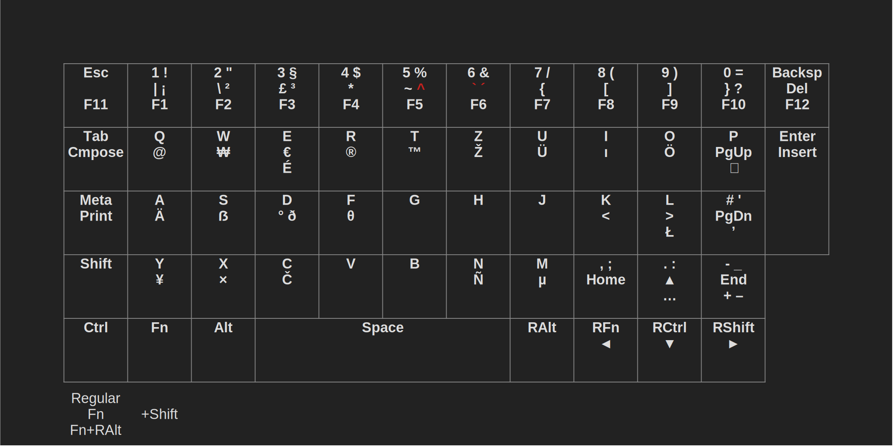
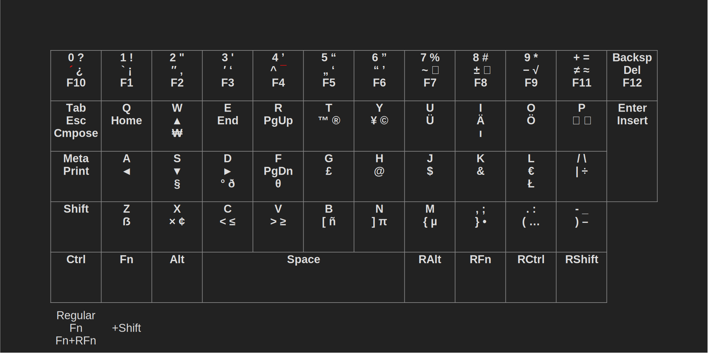

# ppkb-layouts

Some keyboard layouts for the PinePhone Keyboard Case to use it as intended or to go beyond into the realm of custom layouts.

## Content

1. [Introduction](#introduction)
1. [Installing Layouts](#installing-layouts)
	1. [xkb](#xkb)
	2. [tty](#tty)
	3. [Userspace Driver](#userspace-driver)
2. [Layouts](#layouts)
	1. [xkb/loadkeys-Only Layouts](#xkb-loadkeys-only-layouts)
		1. [AltGr/Pine](#altgr-pine)
		2. [FnSymbols-AltGrF12/FnSymbols-PineF12](#fnsymbols-altgrf12-fnsymbols-pinef12)
		3. [DE-AltGr](#de-altgr)
		4. [DE-Pine](#de-pine)
	2. [Driver-Only Layouts](#driver-only-layouts)
		1. [Extended-Simple](#extended-simple)
	3. [Full Layouts](#full-layouts)
		1. [Extended-AltGr/Pine](#extended-altgr-pine)
		2. [Mirrored](#mirrored)
		3. [Mirrored-WASD](#mirrored-wasd)
		4. [DE-Mirrored](#de-mirrored)
		5. [DE-Mirrored-WASD](#de-mirrored-wasd)
		6. [Phalio](#phalio)
4. [Customising Layouts](#customising-layouts)
	1. [Introduction](#introduction-1)
	2. [xkb](#xkb-1)
	3. [tty](#tty-1)
	4. [Userspace Driver](#userspace-driver-1)

## Introduction
**I especially recommend the [mirrored](#mirrored) layouts for thumb-only handheld typing that add a second set of modifier keys on the right side of the keyboard. If you don’t want anything fancy and just some additional useful things, the [AltGr/Pine](#altgr-pine) layouts, or if you need PageUp/Down the [Extended-Simple](#extended-simple)/[Extended](#extended-altgr-pine) layouts, are a good choice.**

## Installing Layouts

Layouts may consist of xkb, tty or driver components. xkb defines symbols for graphical environments and tty/loadkeys defines symbols for ttys. If you only use graphical environments, you may omit the tty part or vice versa. Driver components influence both environments and are usually combined with the other components for full customisability. Each layout includes a list of its components that have to be installed to use the layout.

### xkb

To install and use an xkb layout, you have to copy xkb files to certain directories and then tell your system what layout to use.

#### Copying Files

Copying the xkb files can simple be done by using the `install-xkb.sh` script that comes with this repository. It has to be executed with sudo, so check what it does first. To copy the files manually instead, you have to copy `xkb/pp` and `xkb/pp-usrspc` to `/usr/share/X11/xkb/symbols/`, as well as `xkb/evdev.xml` to both `/usr/share/X11/xkb/rules/evdev.xml` and `/usr/share/X11/xkb/rules/base.xml`, and `xkb/evdev.lst` to both `/usr/share/X11/xkb/rules/evdev.lst` and `/usr/share/X11/xkb/rules/base.lst`.

This will only add the pp and pp-usrspc layout files, so it won’t override any other custom layouts you may have. It will however override any custom entries in evdev.

#### Selecting Layout

xkb is what manages keyboard layouts in graphical environments by default, so there should be ways integrated within your GUI to change it or search engine results that tell you how to do it for your system. If you use systemd, you can simply use `localectl set-x11-keymap <layout> pc105 <variant>`. Substitute `<layout>` and `<variant>` with whatever you want to use, e.g. `localectl set-x11-keymap pp pc105 altgr`. Despite the name, this works for both X11 and Wayland. If you use Sxmo/Sway, you can also put the following lines into your Sway config `~/.config/sxmo/sway`:

```
input * {
    xkb_layout "pp"
    xkb_variant "altgr"
}
```

### tty

To install and use a tty layout, you may optionally copy the keymap file somewhere, and you have to tell your system to use it.

#### Copying Files

It seems to be good practice to put the keymaps into `/usr/local/share/kbd/keymaps/`. This can simply be done by using the `install-tty.sh` script that comes with this repository. It has to be executed with sudo, so check what it does first. To copy the files manually instead, you have to copy the keymaps (or only the one you need) from `tty/` to `/usr/local/share/kbd/keymaps/`.

#### Selecting Layout

To set a permanent layout, use `sudo nano /etc/vconsole.conf` and add the line `KEYMAP=/usr/local/share/kbd/keymaps/ppkb-altgr.map`. Use the path and file name of the layout you want to use.

To immediately set a layout that will not persist after a reboot, use either `sudo loadkeys /usr/local/share/kbd/keymaps/ppkb-altgr.map` from within your tty, or via GUI/SSH use either `sudo loadkeys -C /dev/console -d /usr/local/share/kbd/keymaps/ppkb-altgr.map` or become root with `sudo su` and use `loadkeys /usr/local/share/kbd/keymaps/ppkb-altgr.map`, depending on what works. For me, the former worked on Arch Sxmo and the latter on Manjaro Plasma Mobile.

### Userspace Driver

To use a layout requiring the userspace driver, you have to download the driver, copy the keymap file to it, compile the driver with the keymap and start it.

#### 1. Download

First, in the directory of your choice, clone Megi’s repository by using `git clone https://megous.com/git/pinephone-keyboard`.

#### 2. Keymap File

The key definitions are located in the file `keymaps/factory-keymap.txt`. You can simply override the content of this file with any other keymap by using e.g. `cp ~/git/ppkb-layouts/userspace-driver/extended.txt ~/git/pinephone-keyboard/keymaps/factory-keymap.txt`. Replace the paths and desired keymap with yours.

#### 3. Compiling

To compile you must be in the `pinephone-keyboard` directory and simply use `make`. You may need to install `make`, `gcc`  and `php` first if you don’t have them.

#### 4. Disabling Kernel Driver Input

Kernel driver keyboard input and userspace driver keyboard input cannot be active at the same time. To use the userspace driver, the input part of the PPKB kernel driver has to be disabled. The kernel driver has been renamed with the newer version, so if you are still on the old version where Fn+numRow prints symbols, replace `pinephone-keyboard.disable_input` in the following instructions with `kb151.disable_input`. You have to add this parameter to the kernel arguments.

**On Manjaro**, edit `sudo nano /boot/boot.txt` and at the end of the line starting with “setenv bootargs”, add `pinephone-keyboard.disable_input`. Then use `sudo pp-uboot-mkscr` and reboot.

**On Arch**, go to `cd /boot`, edit `sudo nano boot.txt` and at the end of the line starting with “setenv bootargs”, add `pinephone-keyboard.disable_input`. Then use `sudo ./mkscr` and reboot.

#### 5. Starting the Userspace Driver

The executable for the keyboard input part is `build/ppkb-i2c-inputd`. To run it temporarily, simply execute it with sudo. This will print the keyboard matrix to the terminal for any key you press. To have it active at all times in the background, use e.g. a systemd service as described in the next paragraph.

**To create a systemd service**, use `sudo nano /etc/systemd/system/ppkb-inputd.service` and paste the following lines (adjust the path to ppkb-i2c-inputd to fit yours):

```
[Unit]
Description=PinePhone Keyboard userspace daemon

[Service]
Type=simple
ExecStart=/home/phalio/git/pinephone-keyboard/build/ppkb-i2c-inputd
Restart=on-failure
RestartSec=10
KillMode=process

[Install]
WantedBy=multi-user.target
```

Start the service with `sudo systemctl enable --now ppkb-inputd.service`.

#### Changing the Layout again

Remember, each time you want to use a different layout or have made changes to a layout, you have to not only copy the keymap again but also compile it again (steps 2 and 3). And restart the inputd service if you want a quicker way than rebooting, e.g. `sudo systemctl restart ppkb-inputd.service`.

## Layouts

All layouts also feature a compose key, usually on an additional layer of the Tab key. This key allows to print a wide variety of symbols by combining multiple symbols typed after it, e.g. `Compose` `´`+`e` prints `é`, `Compose` `^`+`1` prints `¹` and much more.

## xkb/loadkeys-Only Layouts

These layouts are limited in what they can do (specifically they cannot add an Fn-layer to any key that doesn’t have one by default) but they are the simplest to install as they only require putting the xkb and/or tty files into the right spot and using a command. They also require the new kernel driver, the one where Fn+numRow results in F1-F10. If you’re still on an older kernel version where these key combinations print extra symbols like |\£, you have to use a layout from the other categories.

### AltGr/Pine


These layouts are intended to be simple and just do two things: They make the extra symbols on the number row accessible using either AltGr or the Pine key and they add more symbols for international compatibility. F11 and F12 are also added just because there was space but on different layers due to F1-10 and Del being on the same layer by default and this layout not intending to change any default mapping.

#### Installation Requirements

xkb: layout: `pp`, variants: `altgr` or `pine`  
tty: `ppkb-altgr.map` or `ppkb-pine.map`

### FnSymbols-AltGrF12 / FnSymbols-PineF12


These layouts are the same as [AltGr/Pine](#altgr-pine) but they swap the number row extra layer keys, so they use the Fn key for extra number row symbols and AltGr or Pine for F1-F12, just like the old kernel driver did.

#### Installation Requirements

xkb: layout: `pp`, variants: `fnsymbols-altgrf12` or `fnsymbols-pinef12`  
tty: `ppkb-fnsymbols-altgrf12.map` or `ppkb-fnsymbols-pinef12.map`

### DE-AltGr


This layout intends to recreate the standard German QWERTZ layout, including placement of symbols. Symbols from missing keys are put on unused third layers of the number row, in the same spot as the symbols printed on the keycaps if possible. The extra letters “ÄÖÜ” are placed on dedicated keys at the bottom right while ß is on the third layer of S. The [DE-Pine](#de-pine) layout is an alternative version of this one that uses the Pine key for the third layer, freeing the AltGr key to be used as another dedicated key for ß. F11 and F12 are also added just because there was space but on different layers due to F1-10 and Del being on the same layer by default and this layout not intending to change any default mapping other than German-specific things.

#### Installation Requirements

xkb: layout: `pp`, variant: `de-altgr`  
tty: `ppkb-de-altgr.map`

### DE-Pine


This layout is the same as [DE-AltGr](#de-altgr) but it uses the Pine key for the third layer, freeing the AltGr key to be used as another dedicated key for ß. This means that all additional letters of the German alphabet, ÄÖÜß, have dedicated keys.

#### Installation Requirements

xkb: layout: `pp`, variant: `de-pine`  
tty: `ppkb-de-pine.map`

## Driver-Only Layouts

These layouts are limited in what they can do as they only change hardware key codes, but that means only one component is required to make them work in both xkb and tty.

### Extended-Simple


This layout is intended to be simple and does only two tings: It adds the additional number row symbols using the Fn as modifier, as well as extending the layout to include some missing keys that some might find important, specifically by adding F11 (commonly used to toggle full screen) on Backspace with the Pine key as modifier and PageUp/Down on P and ; with Fn, moving Insert from ; to Enter.

F12 is not added even though there are 12 keys in the top row because using the userspace driver’s special modifier keys Fn and Pine in combination with the Esc key activates Fn/Pine Lock (like Caps Lock), redefining these additional Esc levels is not possible with a keymap.

[Extended-AltGr/Pine](#extended-altgr-pine) are “advanced” versions of this layout that add international symbols and F12, therefore also requiring an xkb/tty component.

#### Installation Requirements

Userspace driver: `extended-simple.txt`

## Full Layouts

These layouts require both a driver component and an xkb and/or loadkeys component and allow full customisation.

### Extended-AltGr-Pine


This layout adds the additional number row symbols using the AltGr as modifier, as well as extending the layout to include some missing keys that some might find important, specifically by adding F11 and F12 and PageUp/Down on P and ;, moving Insert from ; to Enter and Del to the AltGr layer. It also adds international symbols on additional layers.

#### Installation Requirements

xkb: layout: `pp-usrspc`, variants: `extended-altgr` or `extended-pine`  
tty: `ppkb-extended-altgr.map` or `ppkb-extended-pine.map`  
Userspace driver: `full.txt`

### Mirrored


This layout provides mirrored modifier keys, meaning that both left and right versions of Shift, Control, Fn and Alt exist. This is very useful for thumb-only handheld typing as it allows you to e.g. press RightShift with your right thumb and Q with your left thumb to type a capital Q instead of having to press both LeftShift and Q on the left side, which would require partially letting go of the device with either hand, unless your thumbs are twice as long as mine. It also expands key definitions by F11 F12, PageUp/Down and international symbols.

Since the right versions of Fn, Ctrl and Shift also double as the movement keys ◄ ▼ ► if left Fn is held, it’s not possible to combine left Fn and right Ctrl or Shift. For example, combining left Fn and right Shift to access the fourth layer does not work since LFN+RShift results in ►. Use RFN+LShift (thumb-only-friendly) or LFn+LShift or RFn+RShift instead. If you want right modifier keys that are dedicated and work in any combination, consider using [Mirrored-WASD](#mirrored-wasd) instead which moves the navigation keys to the WASD area.

#### Installation Requirements

xkb: layout: `pp-usrspc`, variant: `mirrored`  
tty: `ppkb-mirrored.map`  
Userspace driver: `full.txt`

### Mirrored-WASD


This layout moves the arrow keys, home/end and pageup/down to WASD QE RF. Like regular [Mirrored](#mirrored), it also  provides mirrored modifier keys, meaning that both left and right versions of Shift, Control, Fn and Alt exist. This is very useful for thumb-only handheld typing as it allows you to e.g. press RightShift with your right thumb and Q with your left thumb to type a capital Q instead of having to press both LeftShift and Q on the left side, which would require partially letting go of the device with either hand, unless your thumbs are twice as long as mine. It also expands key definitions by F11 F12 and international symbols.

#### Installation Requirements

xkb: layout: `pp-usrspc`, variant: `mirrored-wasd`  
tty: `ppkb-mirrored-wasd.map`  
Userspace driver: `full.txt`

### DE-Mirrored



This layout provides mirrored modifier keys, meaning that both left and right versions of Shift, Control, Fn and Alt exist. This is very useful for thumb-only handheld typing as it allows you to e.g. press RightShift with your right thumb and Q with your left thumb to type a capital Q instead of having to press both LeftShift and Q on the left side, which would require partially letting go of the device with either hand, unless your thumbs are twice as long as mine. It also expands key definitions by F11 F12, PageUp/Down and international symbols. It also expands key definitions by F11 F12, PageUp/Down and international symbols.

Besides that, this layout intends to recreate the standard German QWERTZ layout, including placement of symbols. Symbols from missing keys are put on unused third layers of the number row, in the same spot as the symbols printed on the keycaps if possible. Unlike the normal [DE](#de-altgr) layouts, this one puts the extra letters “ÄÖÜß” on the Fn layer of AOUS.

Since the right versions of Fn, Ctrl and Shift also double as the movement keys ◄ ▼ ► if left Fn is held, it’s not possible to combine left Fn and right Ctrl or Shift. For example, combining left Fn and right Shift to access the fourth layer does not work since LFN+RShift results in ►. Use RFN+LShift (thumb-only-friendly) or LFn+LShift or RFn+RShift instead. If you want right modifier keys that are dedicated and work in any combination, consider using [DE-Mirrored-WASD](#de-mirrored-wasd) instead which moves the navigation keys to the WASD area.

#### Installation Requirements

xkb: layout: `pp-usrspc`, variant: `de-mirrored`  
tty: `ppkb-de-mirrored.map`  
Userspace driver: `full.txt`

### DE-Mirrored-WASD


This layout moves the arrow keys, home/end and pageup/down to WASD QE RF. Like regular [DE-Mirrored](#de-mirrored), it also provides mirrored modifier keys, meaning that both left and right versions of Shift, Control, Fn and Alt exist. This is very useful for thumb-only handheld typing as it allows you to e.g. press RightShift with your right thumb and Q with your left thumb to type a capital Q instead of having to press both LeftShift and Q on the left side, which would require partially letting go of the device with either hand, unless your thumbs are twice as long as mine. It also expands key definitions by F11 F12, PageUp/Down and international symbols. It also expands key definitions by F11 F12 and international symbols.

Besides that, this layout intends to recreate the standard German QWERTZ layout, including placement of symbols. Symbols from missing keys are put on unused third layers of the number row, in the same spot as the symbols printed on the keycaps if possible. Unlike the normal [DE](#de-altgr) layouts, this one puts the extra letters “ÄÖÜß” on the Fn layer. Since A and S are already used by the arrow keys unlike in [DE-Mirrored](#de-mirrored), Ä is placed on I since that’s between Ü and Ö, and ß is placed on P since that’s next to ÄÖÜ and right below the key where it would be on a regular German layout.

#### Installation Requirements

xkb: layout: `pp-usrspc`, variant: `de-mirrored-wasd`  
tty: `ppkb-de-mirrored-wasd.map`  
Userspace driver: `full.txt`

### Phalio



This layout started with the goal of making it as close to my usual custom layout as possible, of course also adding badly needed PageUp/Down, F11, F12 and lots of other characters and symbols. This also included putting navigational keys in the WASD area, which is probably the best part of my usual layout. While making it I also had a great idea to solve the thumb-only handheld typing issue: Mirrored modifier keys. In this case they’re really useful, unlike on a regular keyboard where I rarely use them. Typing and using shortcuts like in Emacs works wonderfully and smoothly now.

#### Installation Requirements

xkb: layout: `pp-usrspc`, variant: `phalio`  
tty: `ppkb-phalio.map`  
Userspace driver: `phalio.txt`

## Customising Layouts

### Introduction

### xkb

### tty

### Userspace Driver
